# User and Group Administration

## 1. Create Users and Groups

- Create a new group called `engineers`.
```bash
groupadd engineers
```
- Create two users:
  
`devuser1`: Add to group `engineers`, set `/bin/bash` as default shell, and set a comment `"Developer One"`.
```bash
useradd -m devuser1 -c “Developer One” -s /bin/bash
```
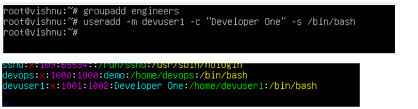
 
`devuser2`: Add to group `engineers`, with a custom home directory `/customhome/devuser2`.
```bash
mkdir /customhome/devuser2
useradd -m -d /customhome/devuser2 devuser2
```
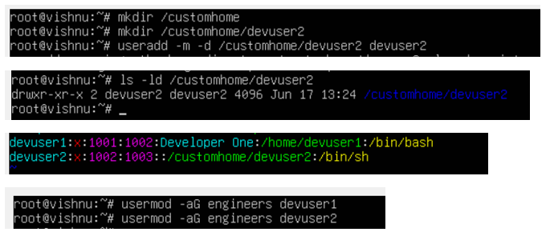

---
## 2. Set Passwords and Apply Password Policies

- Set a password for both users.

```bash
passwd devuser1
passwd devuser2
```
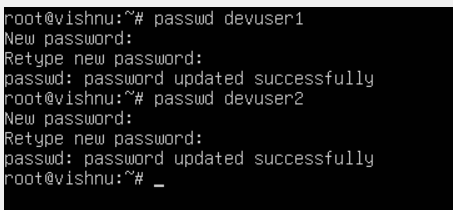
- Configure the following password aging policy for devuser1:
  - Minimum days between password changes: 2
  - Maximum days between password changes: 45
  - Warning days before expiration: 7

```bash
chage -m 2 -M 45 -W 7 devuser1
```
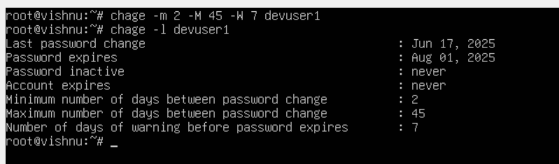

---

## 3. Sudo Access

- Add devuser1 to the sudo (or wheel) group to allow administrative privileges.

```bash
usermod -aG sudo devuser1
```
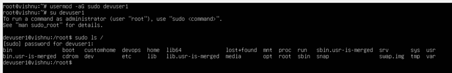

---

## 4. Account Expiry and Lock

- Set an account expiry date for devuser2 (15 days from today).

```bash
chage -E 2025-07-02 devuser1
```
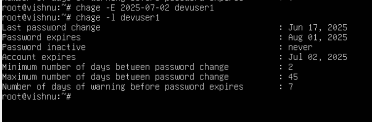

- Lock the devuser2 account temporarily.

```bash
usermod -L devuser2
```
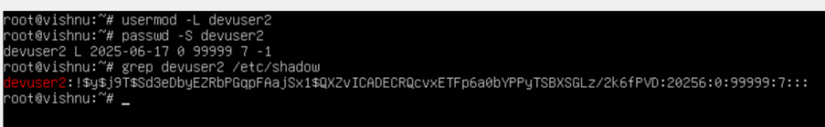

---

## 5. Verification

- Use commands to verify:

 Group membership
```bash
vim /etc/group
```


 Password aging policies
```bash
chage -l devuser1
```
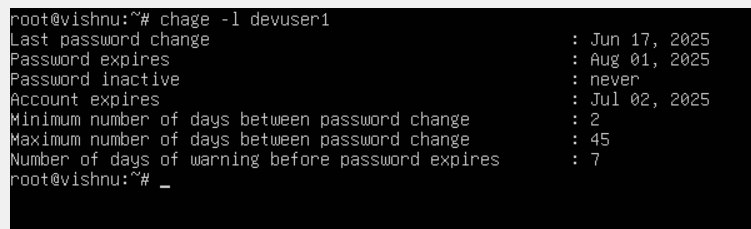
```bash
chage -l devuser2
```
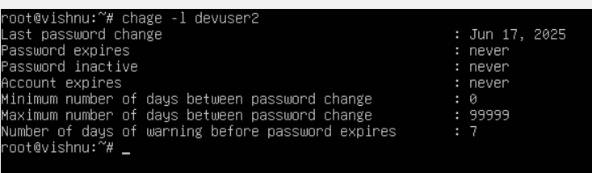

 Sudo access
```bash
sudo -l -U devuser1
```
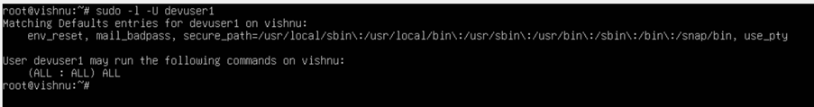

 Account expiration
```bash
chage -l devuser1
chage -l devuser2
```
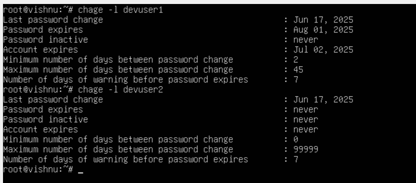

---

## 6. Cleanup

Unlock devuser2 and remove both users (devuser1, devuser2) along with their home directories.
- Unlock devuser2

```bash
usermod -U devuser2
```
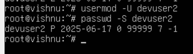

Remove both users along with their home directories

- For devuser1
  
```bash
userdel -r devuser1
```


- For devuser2
  
```bash
userdel -r devuser2
```
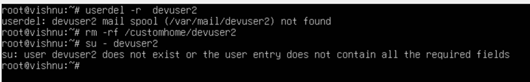

Delete the engineers group.

```bash
groupdel engineers
```
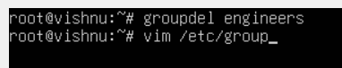
